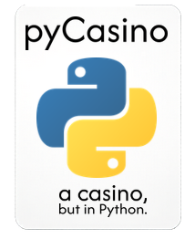

# pycasino
- mini python casino
- it has coin flip, dice rolling, slots, guessing, and drawing straws
- runs in terminal

# how to use (windows):
1. download the exe from releases
2. install python 3 from https://python.org/downloads if you haven't
3. open the exe

 
# how to use (linux and mac):
1. download main.py
2. install python 3 from https://python.org/downloads if you haven't
3. navigate to the folder where the .py file is in terminal (if it's in downloads, run "cd ~/Downloads")
4. run "python main.py"

